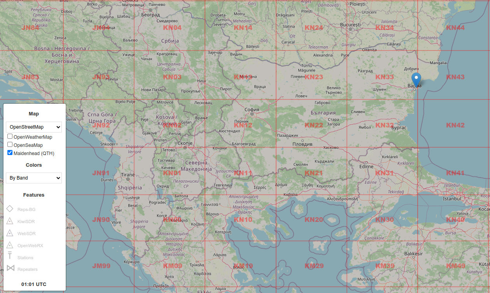

# OWRX+ Map Plugin: Maidenhead (QTH) grid

This `map` plugin will show Maidenhead (QTH) grid on the map as an extra layer.  
This plugin will work up to __OWRX+ v1.2.43__. The later releases have this layer built-in and the plugin will not install.  


# load
Add this line in your `init.js` file:
```js
Plugins.load('https://0xaf.github.io/openwebrxplus-plugins/map/layer_qth_maidenhead/layer_qth_maidenhead.js');
```

# init.js
You can find more info on `init.js` [on github pages](https://0xaf.github.io/openwebrxplus-plugins/) or directly in [my github repo](https://github.com/0xAF/openwebrxplus-plugins)

# preview

