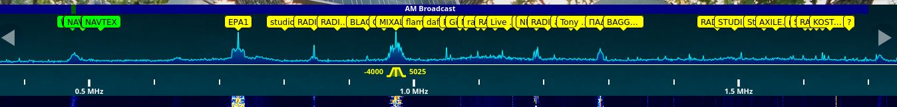

This `receiver` plugin will colorify your spectrum analyzer.

# Preview


# Load
Add this line in your `init.js` file:
```js
Plugins.load('https://0xaf.github.io/openwebrxplus-plugins/receiver/colorful_spectrum/colorful_spectrum.js');
```

# init.js
Learn how to [load plugins](/openwebrxplus-plugins/#load-plugins).
