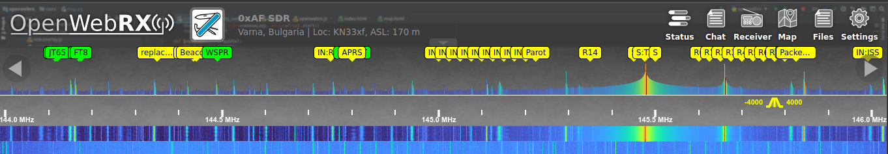

# OWRX+ Receiver Plugin: colorful_spectrum

This `receiver` plugin will colorify your spectrum analyzer.


# load
Add this line in your `init.js` file:
```js
Plugins.load('https://0xaf.github.io/openwebrxplus-plugins/receiver/cororful_spectrum/colorful_spectrum.js');
```

# init.js
You can find more info on `init.js` [on github pages](https://0xaf.github.io/openwebrxplus-plugins/) or directly in [my github repo](https://github.com/0xAF/openwebrxplus-plugins)

# usage
Just works.

# preview

