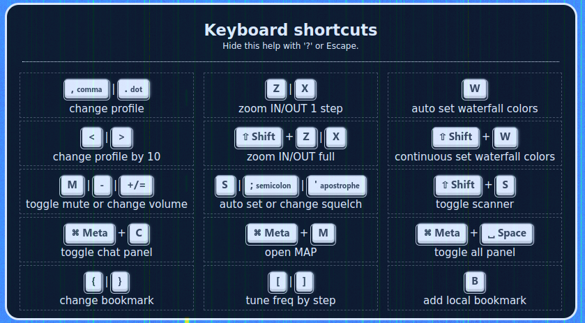

This `receiver` plugin will add keyboard shortcuts to your OWRX+.
The plugin depends on [notify](https://0xaf.github.io/openwebrxplus-plugins/receiver/notify/) plugin.

**OWRX+ v1.2.67 has this plugin integrated, hence the plugin will not install, even if loaded.**

# preview


# Usage
To show help screen, press `?`.

# Load
Add this line in your `init.js` file:
```js
Plugins.load('https://0xaf.github.io/openwebrxplus-plugins/receiver/notify/notify.js');
Plugins.load('https://0xaf.github.io/openwebrxplus-plugins/receiver/keyboard_shortcuts/keyboard_shortcuts.js');
```

# init.js
Learn how to [load plugins](/openwebrxplus-plugins/#load-plugins).
