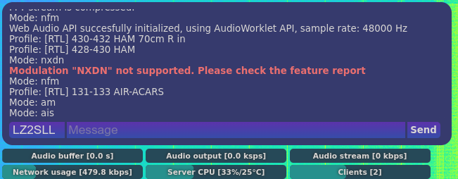

This `receiver` plugin will:
 - Provide spoken notifications to users with Assistive Technology
 - Add invisible div for screen readers
 - Catch events and write to the div, so the screen reader will speak the content.

The plugin depends on [notify](https://0xaf.github.io/openwebrxplus-plugins/receiver/utils) v0.2 plugin.

# Preview


# Load
Add this line in your `init.js` file:
```js
Plugins.load('https://0xaf.github.io/openwebrxplus-plugins/receiver/screen_reader/screen_reader.js');
Plugins.screen_reader.log_messages = true; // if you want to log the messages to the chat window.
```

# init.js
Learn how to [load plugins](/openwebrxplus-plugins/#load-plugins).
