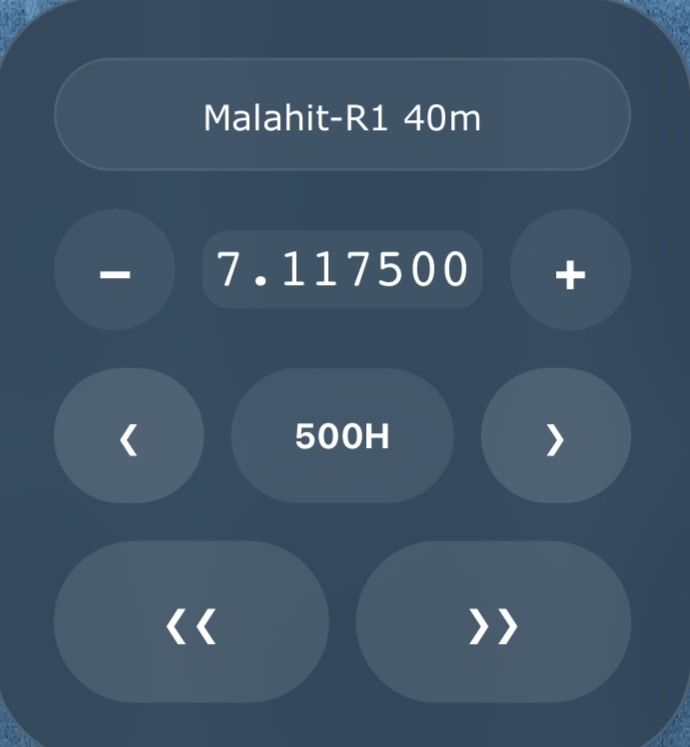

# ThumbTune

A minimalistic, zero-CPU idle floating control panel for OpenWebRX+. 
Designed specifically for easy one-thumb tuning and zooming on mobile devices (e.g., Safari on iPad/iPhone).

## Features
* **Mobile Optimized:** Large touch-friendly numpad and buttons.
* **Floating & Dragable:** Move it anywhere on the screen so it doesn't block the waterfall.
* **Zero-CPU Idle:** Event listeners only trigger upon interaction, saving mobile battery.

## Usage
To enable this plugin, add `'thumbtune'` to the `PluginsToLoad` array in your `receiver/init.js` configuration file.

## Code
[Github repo](https://github.com/0xAF/openwebrxplus-plugins/tree/main/receiver/thumbtune)
