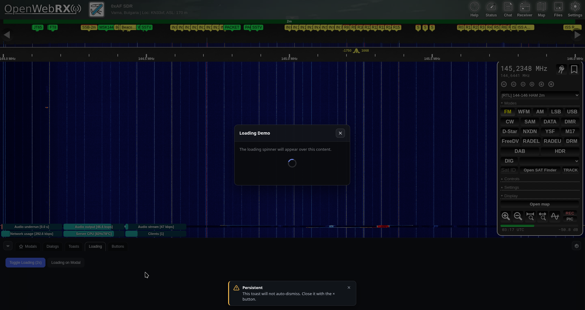

# UI Kit (uikit)

UI helper toolkit for OpenWebRX+ plugins. Provides a dockable panel, settings modal, plugin modals, toast notifications, loading overlays, and helper methods for other plugins to build UI.

**Version:** 0.3

## Preview



## Load

Add to your `plugins/receiver/init.js`:

```js
Plugins.uikit = Plugins.uikit || {};
Plugins.uikit.settings = {
  position:        'bottom',  // top | right | bottom | left
  visible:         true,
  mode:            'push',    // overlay | push
  opacityActive:   0.45,      // panel opacity when active (0.1–1.0)
  opacityInactive: 0.20,      // panel opacity when idle (0.1–1.0)
  autoHide:        false,     // hide panel on inactivity instead of fading
  autoHideDelay:   2          // idle timeout in seconds (0 = disabled, 2–10)
};

await Plugins.load('https://0xaf.github.io/openwebrxplus-plugins/receiver/uikit/uikit.js');

// Optional but recommended: companion theme that matches the uikit palette
await Plugins.load('https://0xaf.github.io/openwebrxplus-plugins/receiver/ui_basic_theme/ui_basic_theme.js');
```

After loading, select **UI Basic** in the OWRX+ theme list to apply the recommended flat dark theme. See [`ui_basic_theme`](https://0xaf.github.io/openwebrxplus-plugins/receiver/ui_basic_theme) for details.

Any key omitted falls back to its default. Settings are merged over the defaults and then over any value previously saved by the user in localStorage, so user preferences always win.

---

## Panel & Settings API

### `addTab(name, opts)` → slug

Adds a tab to the dockable panel. Returns the slug used in the element id.

**opts:** `{ order: number, icon: SVGElement|string, activate: bool }`

### `addSettingsTab(name, opts)` → slug

Adds a tab to the settings modal.

### `getTabEl(name)` → HTMLElement | null

Returns the panel tab content element. Element id: `uikit-tab-{slug}`.

### `getSettingsTabEl(name)` → HTMLElement | null

Returns the settings tab content element. Element id: `uikit-settings-tab-{slug}`.

### `openSettings(tabName?)`

Opens the settings modal, optionally activating a tab by name.

### `closeSettings()`

Closes the settings modal.

### `setPanelPosition(pos)`

Sets panel position (`top` | `right` | `bottom` | `left`).

### `setPanelVisible(visible)`

Shows or hides the panel. Persists to settings. In push mode, adjusts page layout accordingly.

### `setPanelMode(mode)`

Sets panel mode (`overlay` or `push`). In push mode the panel shifts page content aside instead of floating over it.

### `setPanelOpacity(value)`

Sets the inactive opacity (0.1–1.0). Saves to settings and restarts the inactivity timer.

### `svgFromString(svgString)` → SVGElement | null

Parses an SVG string and returns a proper SVG DOM element.

---

## Panel Behaviour

### Overlay vs Push mode

| | Overlay | Push |
| --- | --- | --- |
| Panel position | Floats over page content | Shifts page content aside |
| Idle fade | Yes (fades to inactive opacity) | Yes (if auto-hide is off) |
| Auto-hide | Yes | Yes |

### Inactivity timer

When `autoHideDelay` is greater than 0, a timer starts on every mouse movement and resets each time the mouse moves.

- **Auto-hide off** — when the timer fires the panel fades to `opacityInactive`. Moving the mouse restores `opacityActive`.
- **Auto-hide on** — when the timer fires the panel is hidden entirely (respecting push layout in push mode). Moving the mouse reopens it automatically.

Setting `autoHideDelay` to `0` disables the timer entirely; the panel stays at `opacityActive` at all times.

---

## Button Factory

### `createButton(label, opts)` → HTMLButtonElement

Creates a styled button element.

**opts:**

| Option | Type | Default | Description |
| --- | --- | --- | --- |
| `style` | `'default'`\|`'primary'`\|`'ghost'`\|`'danger'` | `'default'` | Button visual style |
| `onClick` | function\|null | `null` | Click handler |
| `className` | string | `''` | Extra CSS class(es) |
| `title` | string\|null | `null` | Tooltip text |
| `disabled` | bool | `false` | Initially disabled |

```js
var ok = Plugins.uikit.createButton('Save', {
  style: 'primary',
  onClick: function () { m.close(); }
});
m.footerEl.appendChild(ok);

var cancel = Plugins.uikit.createButton('Cancel', { style: 'ghost' });
```

---

## Plugin Modal API

### `createModal(slug, opts)` → handle

Creates and registers a modal. Idempotent — calling again with the same slug updates opts and returns the existing handle.

**opts:**

| Option | Type | Default | Description |
| --- | --- | --- | --- |
| `title` | string\|false | `false` | Title text. Shows title bar if set. |
| `titleBar` | bool | auto | Force title bar on/off. |
| `closeButton` | bool | `true` | Show a close button. |
| `closeButtonPosition` | `'left'`\|`'right'` | `'right'` | Close button placement. |
| `closeOnBackdrop` | bool | `true` | Click outside to close. |
| `closeOnEsc` | bool | `true` | Escape key to close. |
| `border` | bool | `true` | Show border. |
| `borderStyle` | string | theme | CSS `border` shorthand. |
| `borderRadius` | string | theme | CSS `border-radius`. |
| `resizable` | bool | `false` | Drag handle on bottom-right. |
| `width` | string | `'480px'` | Initial width. |
| `height` | string | `'auto'` | Initial height. |
| `minWidth` | string | `'200px'` | Min width (resizable). |
| `minHeight` | string | `'80px'` | Min height (resizable). |
| `className` | string | `''` | Extra CSS class(es). |
| `backdrop` | bool | `true` | Dimming backdrop. |
| `footer` | bool | `false` | Bottom button bar. |
| `onOpen` | function\|null | `null` | Called after modal opens. |
| `onClose` | function\|null | `null` | Called before close. Return `false` to prevent. |

**Handle object:**

```js
{
  contentEl,  // <div> for your content
  footerEl,   // <div> for buttons (null if footer:false)
  open(),     // open the modal
  close(),    // close the modal
  destroy()   // remove from DOM and registry
}
```

### `openModal(slug)`

Opens a registered modal by slug.

### `closeModal(slug)`

Closes a modal. Calls `onClose` hook first — if it returns `false`, the close is prevented.

### `destroyModal(slug)`

Removes a modal from the DOM and internal registry.

### `getModal(slug)` → handle | null

Returns the handle for an existing modal, or `null`.

### Example

```js
var m = Plugins.uikit.createModal('my-dialog', {
  title: 'Settings',
  resizable: true,
  footer: true,
  width: '500px',
  onClose: function () {
    console.log('modal closing');
  }
});

m.contentEl.innerHTML = '<p>Plugin content here</p>';

var saveBtn = Plugins.uikit.createButton('Save', {
  style: 'primary',
  onClick: function () { m.close(); }
});
m.footerEl.appendChild(saveBtn);

m.open();
```

---

## Dialogs

### `info(message, opts)` → Promise

Shows a modal with a message and an **OK** button. Returns a Promise that resolves when OK is clicked. The modal is auto-destroyed.

```js
await Plugins.uikit.info('Scan complete.', { title: 'Done' });
```

**opts:** `{ title: 'Information', okLabel: 'OK', width: '400px' }`

`message` can be a string or an HTMLElement.

### `question(message, opts)` → Promise\<boolean\>

Shows a modal with **OK / Cancel** buttons. Resolves `true` (OK) or `false` (Cancel). Auto-destroyed.

```js
var yes = await Plugins.uikit.question('Delete this bookmark?', {
  title: 'Confirm',
  okLabel: 'Delete',
  cancelLabel: 'Keep'
});
if (yes) { /* confirmed */ }
```

**opts:** `{ title: 'Confirm', okLabel: 'OK', cancelLabel: 'Cancel', width: '400px' }`

---

## Toast Notifications

Replaces the standalone `notify` plugin. Toasts stack vertically with auto-dismiss timers that pause on hover.

### `toast(message, opts)` → id

Shows a toast notification. Returns a unique ID for early dismissal.

**opts:**

| Option | Type | Default | Description |
| --- | --- | --- | --- |
| `type` | string | `'info'` | `'info'`, `'success'`, `'warning'`, `'error'` |
| `title` | string\|false | `false` | Bold title line above the message. |
| `timeout` | number (ms) | `4000` | Auto-dismiss delay. `0` = never. |
| `closable` | bool | `true` | Show × close button. |
| `position` | string | `'bottom-center'` | See positions below. |

**Positions:** `'top-left'`, `'top-center'`, `'top-right'`, `'bottom-left'`, `'bottom-center'`, `'bottom-right'`

```js
Plugins.uikit.toast('Signal locked.', { type: 'success', timeout: 3000 });

Plugins.uikit.toast('Low SNR detected.', {
  type: 'warning',
  title: 'Warning',
  timeout: 5000
});
```

### `dismissToast(id)`

Immediately dismisses a toast by ID (animates out then removes).

### `dismissAllToasts()`

Dismisses all visible toasts.

### Hover pause

When the mouse cursor enters a toast, the auto-dismiss timer pauses and the progress bar freezes. When the cursor leaves, the timer resumes with the remaining time.

---

## Loading Overlay

### `loading(el, show)`

Shows or hides a dimming overlay with a spinner over any DOM element.

- `el` — DOM element or CSS selector string
- `show` — `true` to show, `false` to remove

```js
Plugins.uikit.loading(panelEl, true);
await fetchData();
Plugins.uikit.loading(panelEl, false);
```

Works on modal content too:

```js
var m = Plugins.uikit.getModal('my-modal');
Plugins.uikit.loading(m.contentEl, true);
```

---

## Developer Helpers

These methods are available for plugin developers to build consistent UI that matches the uikit style.

### `el(tag, opts)` → HTMLElement

DOM element factory. Creates and optionally appends a fully configured element in one call.

| Key | Type | Description |
| --- | --- | --- |
| `cls` | string | Sets `className` |
| `text` | string | Sets `textContent` |
| `html` | string | Sets `innerHTML` |
| `id` | string | Sets `id` |
| `title` | string | Sets `title` |
| `type` | string | Sets `type` (for inputs) |
| `attrs` | object | `setAttribute(k, v)` for each key |
| `data` | object | `el.dataset[k] = v` for each key |
| `style` | string\|object | CSS text string or `{ prop: value }` |
| `on` | object | `addEventListener(event, handler)` for each key |
| `children` | array | Child elements to append (falsy items skipped) |
| `parent` | HTMLElement | If set, appends the new element to this parent |
| `disabled` | bool | Sets `el.disabled = true` |

```js
var btn = Plugins.uikit.el('button', {
  cls: 'owrx-uikit__btn owrx-uikit__btn--primary',
  text: 'Go',
  on: { click: function () { doSomething(); } },
  parent: containerEl
});
```

### `createDualSlider(opts)` → handle

Creates a dual-thumb range slider for selecting a `[lower, upper]` range. Both thumbs share a single track with a highlighted fill between them. The lower thumb cannot exceed the upper thumb and vice versa.

**opts:**

| Key | Type | Default | Description |
| --- | --- | --- | --- |
| `min` | number | `0` | Minimum value |
| `max` | number | `1` | Maximum value |
| `step` | number | `0.05` | Step size |
| `lower` | number | `min` | Initial lower thumb value |
| `upper` | number | `max` | Initial upper thumb value |
| `onInput` | function(lo, hi) | — | Called on every thumb move (live preview) |
| `onChange` | function(lo, hi) | — | Called on thumb release (persist/apply) |

**Handle object:**

```js
{
  el,                    // root <div> to insert into your layout
  setDisabled(bool),     // enable/disable both thumbs
  setValues(lo, hi)      // programmatically update both thumb positions
}
```

```js
var slider = Plugins.uikit.createDualSlider({
  min: 0, max: 1, step: 0.05,
  lower: 0.2, upper: 0.8,
  onInput: function (lo, hi) {
    previewEl.textContent = Math.round(lo * 100) + '% – ' + Math.round(hi * 100) + '%';
  },
  onChange: function (lo, hi) {
    saveMySettings(lo, hi);
  }
});
myContainer.appendChild(slider.el);
```

### `renderRadioGroup(container, name, options, current, onChange)`

Renders a group of styled radio buttons into `container`, clearing any existing content.

- `options` — array of strings **or** `{ value, label, data }` objects. The `data` key sets `dataset` entries on the label element (e.g. `{ pos: 'top' }` → `data-pos="top"`).
- `current` — the initially selected value.
- `onChange(value)` — called when a radio is selected.

```js
Plugins.uikit.renderRadioGroup(myDiv, 'my-group',
  ['option-a', 'option-b', 'option-c'],
  'option-a',
  function (val) { applyOption(val); }
);
```

### Icon builders

All return an `<svg>` element sized 16×16 by default.

| Method | Description |
| --- | --- |
| `iconArrow(dir)` | Chevron arrow. `dir`: `'up'` \| `'down'` \| `'left'` \| `'right'` |
| `iconCog()` | Settings / gear icon |
| `iconChevron()` | Up-pointing chevron (collapse indicator) |
| `iconHide()` | Horizontal lines (hide/minimise indicator) |
| `iconClose()` | × close icon |
| `iconPanel()` | Panel / window icon (24×24) |

```js
var arrow = Plugins.uikit.iconArrow('right');
myButton.appendChild(arrow);
```

### `buildSvg(viewBox, paths, size)` → SVGElement

Low-level SVG builder used by all icon helpers. `paths` is an array of inner SVG markup strings. `size` defaults to `16`.

```js
var icon = Plugins.uikit.buildSvg('0 0 24 24', [
  '<circle cx="12" cy="12" r="5"/>',
  '<path d="M12 2v2M12 20v2"/>'
], 20);
```

---

## CSS Classes

All styles are scoped under `.owrx-uikit`. Button classes available for use in modals and footers:

- `.owrx-uikit__btn` — base button
- `.owrx-uikit__btn--primary` — primary action (blue)
- `.owrx-uikit__btn--danger` — destructive action (red)
- `.owrx-uikit__btn--ghost` — secondary/cancel (outline)

The dual-range slider is styled via `.owrx-uikit__dual-range` and its children — no extra work needed if you use `createDualSlider`.

---

## Demo Plugin

See `receiver/example_uikit/` for a working demo that exercises every feature described above. Load it after uikit:

```js
await Plugins.load('https://0xaf.github.io/openwebrxplus-plugins/receiver/uikit/uikit.js');
await Plugins.load('https://0xaf.github.io/openwebrxplus-plugins/receiver/example_uikit/example_uikit.js');
```

---

## Theme Integration

### OWRX+ theme colours

When an OWRX+ theme is active (`body.has-theme`), uikit surfaces automatically pick up the theme's colours:

| Surface | CSS variable used |
| --- | --- |
| Panel, content area, active tab | `--theme-color2` |
| Tab bar, inactive tabs, modal header | `--theme-color1` |
| Toasts | `--theme-color2` |

In themed mode the auto-fade uses element `opacity` instead of background alpha (so `backdrop-filter` blur is not expected to show through a solid theme colour).

### `--uikit-*` CSS variables

All uikit colours are driven by CSS custom properties with sensible dark-mode fallbacks. A theme only needs to define the variables it wants to override — undefined variables fall back automatically.

| Variable | Default | Description |
| --- | --- | --- |
| `--uikit-accent` | `#6f89ff` | Slider fill, checked radio/checkbox highlight |
| `--uikit-accent-dim` | `rgba(111,137,255,.25)` | Accent background tint |
| `--uikit-btn-bg` | `rgba(255,255,255,.06)` | Default button background |
| `--uikit-btn-text` | `#e9edf5` | Default button text |
| `--uikit-btn-primary-bg` | `#3b5bfd` | Primary button background |
| `--uikit-btn-primary-text` | `#ffffff` | Primary button text |
| `--uikit-btn-danger-bg` | `rgba(226,76,76,.15)` | Danger button background |
| `--uikit-btn-danger-border` | `rgba(226,76,76,.4)` | Danger button border |
| `--uikit-btn-danger-text` | `#ff9e9e` | Danger button text |
| `--uikit-btn-ghost-border` | `rgba(255,255,255,.12)` | Ghost button border |
| `--uikit-btn-ghost-text` | `#d9dde6` | Ghost button text |
| `--uikit-text` | `#f6f7f9` | Primary text |
| `--uikit-text-dim` | `#cdd2db` | Secondary text |
| `--uikit-text-muted` | `#9aa3b2` | Muted / label text |
| `--uikit-border` | `rgba(255,255,255,.08)` | Subtle border |
| `--uikit-border-strong` | `rgba(255,255,255,.35)` | Strong border (active tab) |
| `--uikit-border-mid` | `rgba(255,255,255,.12)` | Mid-weight border |

Set these on `body.theme-yourtheme { }` in your theme CSS file. uikit buttons and controls inside `.owrx-uikit` will inherit them without any extra selectors.

### Recommended companion theme: `ui_basic_theme`

[`ui_basic_theme`](https://0xaf.github.io/openwebrxplus-plugins/receiver/ui_basic_theme) reproduces the original flat dark uikit palette (near-black, cool tint) as a proper OWRX+ theme entry. It defines all `--uikit-*` variables and also corrects the native OWRX+ inputs and buttons for the flat look. Load it alongside uikit:

```js
await Plugins.load('https://0xaf.github.io/openwebrxplus-plugins/receiver/uikit/uikit.js');
await Plugins.load('https://0xaf.github.io/openwebrxplus-plugins/receiver/ui_basic_theme/ui_basic_theme.js');
```

Then select **UI Basic** in the OWRX+ theme list.

### Native OWRX+ inputs and selects inside modals

uikit adds the `openwebrx-panel` class to modal bodies and the panel content area. This allows OWRX+ theme CSS to style `<input>` and `<select>` elements inside uikit surfaces automatically, matching the rest of the receiver UI. Non-text inputs (checkboxes, radios, range sliders) are exempt via explicit `revert` rules so their native appearance is preserved.

### Keyboard handling in modals

All modals capture `keydown` and call `stopPropagation()` so that OWRX+'s global keyboard shortcuts (frequency entry, mode keys, etc.) do not fire while typing in modal inputs. The Escape key is also handled by the modal and does not bubble to the page.

---

## Notes

- Settings are stored under localStorage key `uikit` via `LS.save/LS.loadStr`.
- On mobile (viewport < 768px), only `top` and `bottom` panel positions are available.
- Toast containers are appended to `document.body`, independent of the panel position.
- Plugin modals are appended to the uikit root element at z-index 10001.
- The inactivity timer uses a single `mousemove` listener and is shared between the opacity fade and the auto-hide behaviour. Only one timer runs at a time.
- In push mode, auto-hiding the panel via the inactivity timer correctly restores page layout (padding/margins) — identical to the user clicking the toggle button.
- When a theme is active (`body.has-theme`), fading uses element `opacity` so the solid theme background is preserved. Without a theme, background-alpha is used so `backdrop-filter: blur()` shows through.
